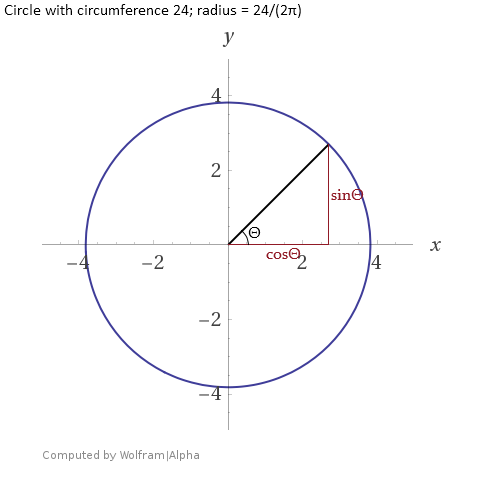

 
```{r setup, include=FALSE}
knitr::opts_chunk$set(echo = TRUE,
                      out.width = "50%", 
                      fig.align = "default")
```

<style>
<!--body {
  line-height: 1.6em;
}-->

h4 {
  padding-top: 1.5em;
}

.box {
  border-style: solid; 
  padding: 1em; 
  border-width: 0.05em;
}

.python {
border-color: #3c3;
border-width: 0.25em;
border-radius: 0.2em;
}

.r {
border-color: #39c;
border-width: 0.25em;
border-radius: 0.2em;
}

.caption {
font-size: 0.9em;
font-style: italic;
}
</style>

---------

Many cases involve periodic (or cyclical) features. These are features that naturally have looping values; for example, time of day (24-hour cycle), seasons, angles of rotating bodies, virtual wraparound spaces, and most anything sinusoidal. Acceptable methods for handling these values are dependent on the algorithms employed. It is not appropriate to treat these attributes the same as normal one-dimensional attributes because that makes the minimum and maximum values far apart spacially\* when they should be considered close. This article provides a necessary awareness of implications and methods involving these attributes.</br>
<div class = caption>
**\***The formal spelling is “spatial”, but “spacial” is sometimes chosen because it more clearly references “space”.</br></div>

# Neural Networks and Linear Regression

The most common solution to use periodic data in a neural network is to transform each periodic attribute to a two-dimensional circle, so that the inputs are the sine and cosine of the angle.
Adjusting the radii of the attributes is unnecessary because the final coefficients or weights will fit themselves accordingly. Getting the radii right will probably take more time than it saves in training.

<div style="text-align: center;">
**Example for time of day**


</div>

| Time | Derived Input A, sinΘ* | Derived Input B, cosΘ* |
|-----|-----|-----|
| Midnight | sin(0) = 0 | cos(0) = 1 |
| 3 AM | sin(π/4) = 0.7071 | cos(π/4) = 0.7071 |
| 9 AM | sin(3π/4) = 0.7071 | cos(3π/4) = -0.7071 |
| 2 PM | sin(7π/6) = -0.5 | cos(7π/6) =  -0.866 |
| 8 PM | sin(5π/3) = -0.866 | cos(5π/3) = 0.5 |

<div class = caption>
**\***Multiplying by the radius, 3.8197, would be acceptable but unnecessary for most tasks.
</div>
 
Technically, this transformation distorts the distance between values: Points on opposite ends of the cycle should be π$\cdot$radius apart but are treated as if they are only 2$\cdot$radius apart. This is acceptable for a neural network however, because it can find such non-linear relationships. The principles and general approaches described in this section apply to other supervised learning methods like linear regression, but it may be helpful to keep this distortion in mind while searching for a good model. Having some contextual knowledge of the data makes modeling sinusoidal relationships easier.

As part of the universal approximation theorem, any neural network with at least one hidden layer, an unspecified number of neurons, and a non-linear activation function can approximate sinusoidal functions. Non-linear activation functions include RELU, which is mostly linear.
Though not common in modern practice, some neural networks have been built with sinusoidal activation functions, like sine and sine cardinal. In theory, there are cases where they would be preferred. </br>
https://www.researchgate.net/publication/3835580_Neural_networks_with_periodic_and_monotonic_activation_functions_a_comparative_study_in_classification_problems

Information on neural networks predicting periodic values is sparse, so I have written a simple network that demonstrates this capability. Other architectures will be better for various tasks; but after testing, this was the best model I found for the synthetic data created here.</br>

#### Fake Data

```python
    # Python script

    import numpy as np 
    from matplotlib import pyplot as plt

    # Make up data
    y = np.arange(0, 30*np.pi, np.pi/7.1)
    x = np.column_stack((np.sin(y), np.sin(y + np.pi/4)))
    noise = np.random.normal(0, np.pi/30, len(y))
    y = y+noise
    y = np.mod(y, 2*np.pi)

    # What data looks like
    fig = plt.figure(figsize=(6,5))
    ax = fig.add_subplot(111, xlabel = 'y', ylabel = 'x1 in red, x2 in blue')
    ax.scatter(y, x[:,0], color=[1, 0, 0, 0.3])
    ax.scatter(y, x[:,1], color=[0, 0, 1, 0.3])
```

<div style="text-align: center;">

</div>

<div class = caption>
I chose to make the data a little noisy and instead of being the sine and cosine of the target variable `y`, the explanatory variables `x1` and `x2` are only a one eighth period apart.</div></br>

By converting and predicting the sine and cosine of the target angles I get much better results. It is easy to convert predicted rectangular coordinates to the single periodic value, named `real_y_pred` in the script. I attempted tanh for the final activation function because it ranges from -1 to 1 but found that a linear activation performs better.</br>

#### Multilayer-Perceptron

```python
    # Python script continued

    from keras.layers import Input, Dense
    from keras.models import Model
    from keras.callbacks import EarlyStopping
    from sklearn.model_selection import train_test_split

    # Train a model
    y_transformed = np.column_stack((np.cos(y), np.sin(y)))

    x_train, x_test, y_train, y_test = train_test_split(x, 
                                                        y_transformed, 
                                                        test_size=0.2)
    inputs = Input(shape=(2,))
    hidden1 = Dense(8, activation='elu')(inputs)
    hidden2 = Dense(4, activation='elu')(hidden1)
    outputs = Dense(2, activation='linear')(hidden2)

    model = Model(inputs=inputs, outputs=outputs)
    model.compile(optimizer='adam',
                  loss='mean_absolute_error',
                  metrics=['mean_squared_error'])

    model.fit(x_train, y_train, 
              validation_data=(x_test, y_test), 
              epochs = 2000,
              callbacks = [EarlyStopping(monitor='val_loss', 
                                         mode='min', 
                                         patience = 150)])

    # Test
    y_pred = model.predict(x_test)
    print("MLP results:")
    print("MAE for cos(y) and sin(y) =", np.mean(np.abs(y_test - y_pred)))
    real_y_test = np.mod(np.arctan2(y_test[:,1], y_test[:,0]), 2*np.pi)
    real_y_pred = np.mod(np.arctan2(y_pred[:,1], y_pred[:,0]), 2*np.pi)
    print("MAE for y =", np.mean(np.abs(real_y_test - real_y_pred)))
```

#### K-Nearest-Neighbors (To Compare)

```python
    # Python script continued

    from sklearn.neighbors import KNeighborsRegressor as KNN

    # Compare to a very simple model
    knn_model = KNN(n_neighbors=2)
    knn_model.fit(x_train.reshape(-1, 2), y_train)
    knn_pred = knn_model.predict(x_test.reshape(-1, 2))
    print("\nKNN results:")
    print("MAE for cos(y) and sin(y) =", np.mean(np.abs(y_test - knn_pred)))
    real_knn_pred = np.mod(np.arctan2(knn_pred[:,1], knn_pred[:,0]), 2*np.pi)
    print("MAE for y =", np.mean(np.abs(real_y_test - real_knn_pred)))
```
 

#### Results

<div class = "box">
MLP results: </br>
MAE for cos(y) and sin(y) = 0.056096028534601605 </br>
MAE for y = 0.08474142088002712

KNN results: </br>
MAE for cos(y) and sin(y) = 0.06865971070310278 </br>
MAE for y = 0.10670556797752576
</div>

#### The above process done with R

Note: Installing the Keras library in R can be a little bit involved. [Click here to read some notes I created on the process.](quickly_learn_keras_in_python_and_r.html)


```r
    # R script

    library(tensorflow)
    library(keras)
    library(tidyverse)
    library(caret) # For KNN

    # Fake data
    y <- seq(0, 30*pi, pi/7.1)
    df <- data.frame(x1 = sin(y), 
                     x2 = sin(y + (pi/4)), 
                     y = (y + rnorm(length(y), 0, pi/30)) %% (2*pi))

    # What it looks like
    df %>% 
      ggplot(aes(x = y, y = x1)) +
      geom_point(color = 'red', alpha = 0.5) +
      geom_point(aes(y = x2), color = 'blue', alpha = 0.5) +
      labs(y = 'x1 in red, x2 in blue')

    # Add trigonometric transformation to target value
    df <- df %>% 
      mutate(cos_y = cos(y), 
             sin_y = sin(y))

    # Train-test split
    train_rows <- sample(1:nrow(df), nrow(df)*0.8, replace = F)
    train <- df[train_rows, ]
    test <- df[-train_rows, ]

    #####
    # Build model

    inputs <- layer_input(shape = c(2))
    outputs <- inputs %>% 
      layer_dense(8, activation = 'elu') %>% 
      layer_dense(4, activation = 'elu') %>% 
      layer_dense(2, activation = 'linear')

    model <- keras_model(inputs = inputs, outputs = outputs)
    model %>% compile(
      optimizer = 'adam',
      loss = 'mean_absolute_error',
      metrics = c('mean_squared_error'))

    model %>% fit(
      as.matrix(train[1:2]), 
      as.matrix(train[4:5]), 
      validation_data = list(
        as.matrix(test[1:2]), as.matrix(test[4:5])), 
      epochs = 2000,
      callbacks = list(
        callback_early_stopping(
          monitor = 'val_loss',
          mode = 'min',
          patience = 150)))

    # Test model
    y_pred <- as.data.frame(model %>% predict(as.matrix(test[1:2])))
    print("MLP results:")
    print(paste("MAE for cos(y) and sin(y) =", mean(abs(as.matrix(test[4:5] - y_pred)))))

    real_y_pred = atan2(y_pred[,2], y_pred[,1]) %% (2*pi)
    errors <- abs(test$y - real_y_pred)
    # Correct for predictions near 2pi
    errors <- if_else(errors > pi, abs(errors - 2*pi), errors)
    print(paste("MAE for y =", mean(errors)))

    # Compare to a very simple model
    knn_model <- knnreg(train[1:2], as.matrix(train[4:5]), k = 2)
    knn_pred <- predict(knn_model, as.data.frame(test[1:2]))

    print("\nKNN results:")
    print("MAE for cos(y) and sin(y) =", mean(abs(test$y - knn_pred)))
    real_knn_pred = atan2(knn_pred[,2], knn_pred[,1]) %% (2*pi)
    errors <- abs(test$y - real_knn_pred)
    # Correct for predictions near 2pi
    errors <- if_else(errors > pi, abs(errors - 2*pi), errors)
    print("MAE for y =", mean(errors))
```

As shown by the plot below, the neural network tends to predict along the circle. It appears that using MSE for the loss function works well enough.</br>

<div style="text-align: center;">
{height=50em}
</div>
 
## Computing Distance
Many algorithms rely on distance measurements. These include K-Nearest Neighbors and clustering algorithms like OPTICS and K-means. The distortions from using the trigonometric transformation described in the previous section are suboptimal for most of these algorithms. A type of cosine similarity can work but comes with its own issues that are explained in the "What Ifs" section at the end of this article.</br>
A flawless and simple solution for computing distances involving periodic attributes is to use the shortest distance along each periodic attribute to the neighboring point. Aside from attribute scaling, this is all that is needed because most if not all distance metrics use the differences along each dimension independently; for example, the Euclidean distance uses the Pythagorean theorem, taking the square root of the sum of the squared differences.
<div style="text-align: center;"></div>
Precise implementation will vary, but the approach I've used here is to take the absolute difference between the points along the dimension; then, if the dimension is periodic and the difference is greater than half the length of the period, subtract the length of the period and return the absolute value.

$$
\text{distance between}\ x_0\ \text{and}\ x_1\ \text{along cyclical dimension}\ x=\\
\begin{cases}
  ||x_1-x_0|-(x\text{-}max-x\text{-}min)|,& |x_1-x_0| > (x\text{-}max - x\text{-}min) ÷ 2 \\
  |x_1-x_0|,& otherwise
\end{cases}
$$

It can be expensive to constantly compute the distance between a point and all others, especially when conditional checks are involved. One way to reduce computation is to compute a full distance matrix for later reference. Not only does the matrix only need to be computed once, but math on matrices can be parallelized. Precomputed distance matrixes are often the only way to supply a custom distance metric to a library function. Supplied below are functions written in R and Python for building a distance matrix when periodic attributes are involved:
 
```python
# Python script

import numpy as np
from scipy.spatial import distance_matrix
import pandas as pd
import warnings

"""
dat: 
    A pandas dataframe or object that can be converted into pandas dataframe
ranges: 
    A list describing each column using any of these elements:
        Float or integer that indicates the length of the period.
        A list or tuple containing the min and max values of the period.
        None. Indicates that the column is not periodic.
"""

def periodic_distance_matrix(dat, ranges = None):
    if type(dat) != pd.core.frame.DataFrame:
        dat = pd.DataFrame(dat)
        
    if type(ranges) == type(None):
        warnings.warn("No range information supplied. " +
                      "Taking max-min for each column.")
        ranges = []
        for col in dat:
            ranges.append(np.ptp(dat[col]))
    else:
        if type(ranges) != list:
            raise ValueError("Argument 'ranges' needs to be of type list.")
        ranges = [np.ptp(r) if type(r) == list or type(r) == tuple 
                  else r for r in ranges]
        print(ranges)
    distances = np.zeros((dat.shape[0],dat.shape[0])).astype('float64')
    for i in range(dat.shape[1]):
        values = dat.iloc[:,i].values.reshape(len(dat), 1)
        col_dist = distance_matrix(values, values)
        if ranges[i] != None:
            col_dist[col_dist > ranges[i]/2] -= ranges[i]
        distances += col_dist**2
    return np.sqrt(distances)
```

```r
# R Script

# Returns distance matrix ("dist" class) for data points when some values belong to periodic/cyclical attributes.
# E.g. 23:59 is only one minute away from 00:00, not 23 hours and 59 minutes.

periodic_dist <- function(dat, 
                          ranges = NULL,
                          diag = T, upper = T) {
  # Check arguments
  if (sum(class(dat) %in% c("data.frame", "tbl_df", "tbl")) < 1) {
    stop("\nArgument 'dat' should be a tibble or dataframe.")
  } else {
    # This shouldn't happen, but if I can make the mistake someone else might.
    if (sum(class(dat[[1]]) %in% c("data.frame", "tbl_df", "tbl")) > 0) {
      stop("\nIt appears you supplied a tibble containing a dataframe or tibble.\n",
           "Did you use tibble() instead of as_tibble()? Try nameOfYourData[[1]].")
    }
  }
  if (is.null(ranges)) {
    warning("\nArgument 'ranges' not provided.\n",
        "All columns treated as periodic and set column ranges to lowest and highest values.")
    ranges <- list()
    for (col in dat) {
      # Append vector to list
      ranges <- c(ranges, list(range(col)))
    }
  } else {
    if (class(ranges) != "list") {
      stop(paste("\nProvide argument 'ranges' as a list of vectors and values describing each column.", 
                 "If a column is periodic provide a min and max vector, like c(1, 12) for month, 
or a single range value (computed by min - max), like 2*pi for angle.", 
                 "If a column is not periodic, provide NA.",
                 "Example: list(c(0,1), c(1,12), 2*pi, NA)", 
                 sep = "\n"))
    }
  }
  
  # Initialize distance matrix
  distances <- dist(rep(0, nrow(dat)), diag = diag, upper = upper)
  
  for (i in 1:length(dat)) {
    col_dist <- dist(dat[i], diag = diag, upper = upper)
    
    if (sum(is.na(ranges[[i]])) < 1) {
      # Replace values greater than half the possible distance 
      # with the remaining distance
      range_val <- ranges[[i]]
      if (length(range_val) > 1) {
        range_val <- range_val[2] - range_val[1]
      }
      too_high <- which(col_dist > range_val/2)
      col_dist[too_high] <- 
        abs(range_val - col_dist[too_high])
    }
    # cat("col_dist", col_dist)
    # Increment distance^2
    distances <- distances + col_dist^2
    # cat("\n", distances)
  }
  # Complete distance formula by taking square root
  return(sqrt(distances))
}
```

This article might also be of interest: </br> https://www.researchgate.net/publication/263871195_K-MEANS_CLUSTERING_FOR_PROBLEMS_WITH_PERIODIC_ATTRIBUTES, </br>
DOI: 10.1142/S0218001409007338

## Decision Trees
Decision trees divide attribute values into discrete chunks. If no special treatment is given to periodic inputs, then a split is forced to occur at the start/end of the cycle and hinders potential accuracy. This is probably less of an issue for ensemble models, but decision trees will perform better if the periodic attributes are accounted for. Periodic variables to be predicted are best transformed as well.</br>
It is possible to build a modified decision tree that accepts a tag indicating an attribute is periodic. The trained model would include more complicated conditionals at each branch that splits on these attributes. Here is a visual example for a binary split:
<div style="text-align: center;">
</div>
Choose two split points. Start with the section of the period that does not include the minimum/maximum point. Assign all points greater than the lower split and lower than the higher split to this section. Assign all other points to the other section.</br>
This document addresses this: https://hal.archives-ouvertes.fr/hal-01561514/document</br>

I may implement this in the future, but if you do it first, let me know. Ideally, this decision tree object will support more than binary splits.</br>

## What Ifs
<div style="font-size:0.1em; line-height:0.1em;"></br></div>

##### *Why only two?*
One might consider using more than two transformations. For example, three evenly spaced trigonometric transformations are sin(x), sin(x+2π/3), and sin(x+4π/3). This has no benefit as it creates a parameterized circle in three dimensions instead of two, which is subject to exactly the same measurement distortions at the cost of greater complexity.</br></br>

##### *Can you just take the dot product to compare similarity?*
If all or most variables are periodic, one might consider computing a type of angular distance as described:

$$
  \text{The}\ ``\text{pseudo-angular}"\text{distance between vectors}\ \hat{a}\ \text{and}\ \hat{b}\ \text{with all cyclical dimensions} =\\ \cos^{-1}\frac{(\sin\hat{a}\ ^\frown\cos\hat{b})\cdot(\sin\hat{a}\ ^\frown\cos\hat{b})}{|\sin\hat{a}\ ^\frown\cos\hat{b}|\cdot|\sin\hat{a}\ ^\frown\cos\hat{b}|}
\\
\text{where each attribute in}\ \hat{a}\ \text{and}\ \hat{b}\ \text{is in an angle according to the location on its period.}\\
\text{The}\ ^\frown \ \text{indicates concatenation.}
$$

This works better on trigonometrically transformed periodic variables than Euclidean distance does on the transformed variables, but it is still subject to its own distortions and is not helpful in situations where the distance must be precisely measured. The problem arises in the fact that the wraparound space created by looping rectangular spaces does not form proper hypersphere. This pseudo-angular distance metric could be more convenient in some cases or bring marginal calculation speed benefits, but this is still an inferior approach to the conditional algorithm provided previously because it doubles the number of dimensions to do an otherwise simple task. The graphics below show the behavior of the Euclidean (without trigonometric transformation, using an *if* statement) and pseudo-angular (with transformation) distance measurements: </br>

```{r image, echo = FALSE}
knitr::include_graphics(c("images/Euclidean.png", "images/Angular.png"))
```

<div class = caption>Note: The spacing between contour lines is not precisely the same between the two plots. There’s something with geom_contour I would need to correct.</div></br>
If two periodic variables are to be continuously expressed in three dimensions, it can only be done using a torus. An undistorted mapping can exist in 4D space. As mentioned, the shapes created by these wraparounds are not n-spheres. Some attempt has been made to demonstrate the four-dimensional shape. In this 3D plot, the fourth dimension, w, is represented by the size and color of the points: 
<div style="text-align: center;"></div>

After searching, I found that this is called a Clifford torus, belonging to a family of tori in even-numbered spaces. A proof for the Euclidean distance can be found here:</br> https://math.stackexchange.com/questions/965654/distance-between-two-points-on-the-clifford-torus

The code for this visualization can be found [here](visualize_wrapfield.R).
 
<div style="text-align: center; font-size: 1.6em; margin-bottom: 2em; margin-top: 2em;">[Return](index.html)</div>